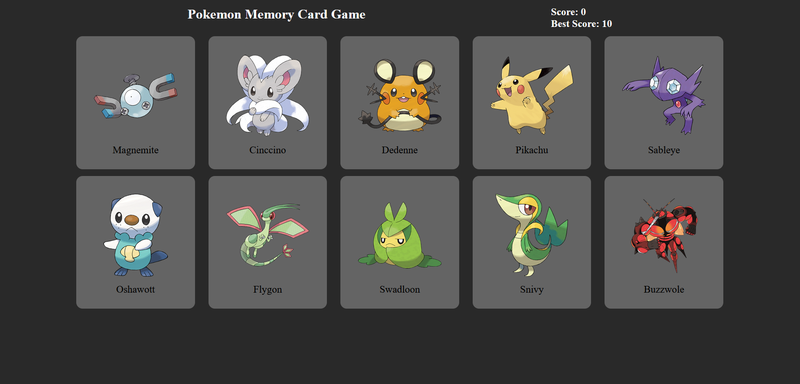

# Memory Card Game

This is my first React app (at least, since graduating a couple years ago). It's a simple card game where the goal is to select all the characters one at a time until you've selected them all. The catch is that they are randomly shuffled every time you select one and you cannot select the same character more than once. The purpose of this project was to practice using React, specifically, using functional components and hooks.

[Live Demo (there's a bug where you might have to refresh the page to show the cards. I may or may not come back to fix it 🙃](https://calm-frangollo-582c28.netlify.app/)

## Screenshot

## Lessons Learned

This project helped me improve my skills in:
- Using React hooks
- Passing data between components
- Implementing side effects (fetching data from an API)

## Credits
- https://pokeapi.co for Pokemon names/sprites
- https://bulbapedia.bulbagarden.net/wiki/Pok%C3%A9mon_of_the_Year for the list of the most popular Pokemon
